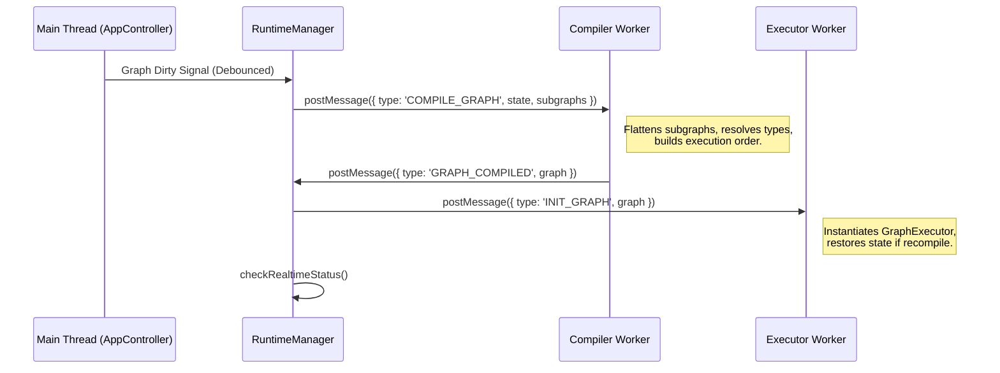
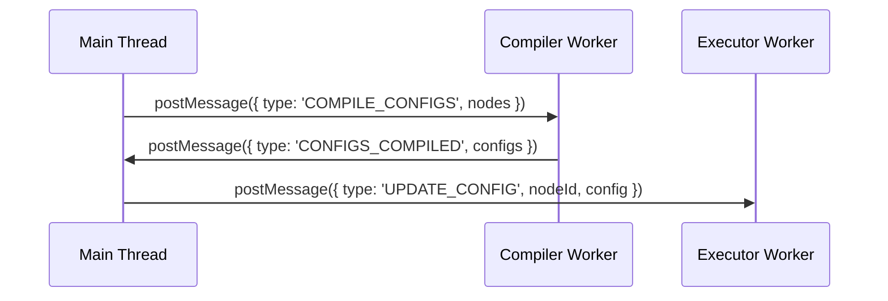
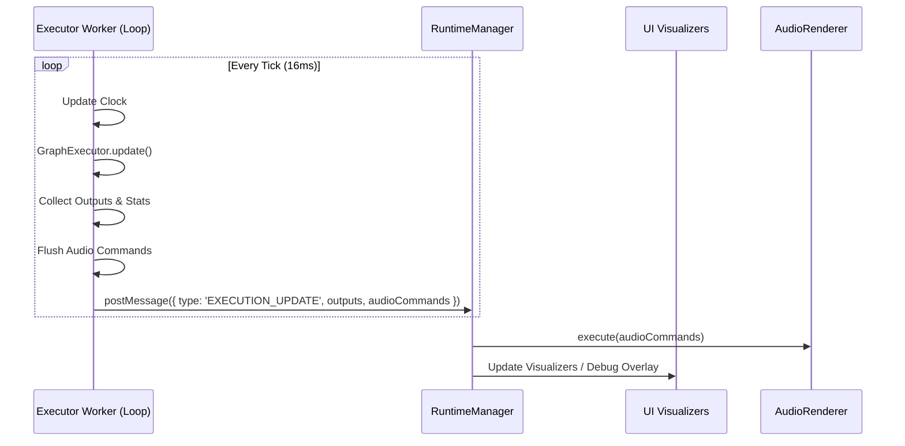
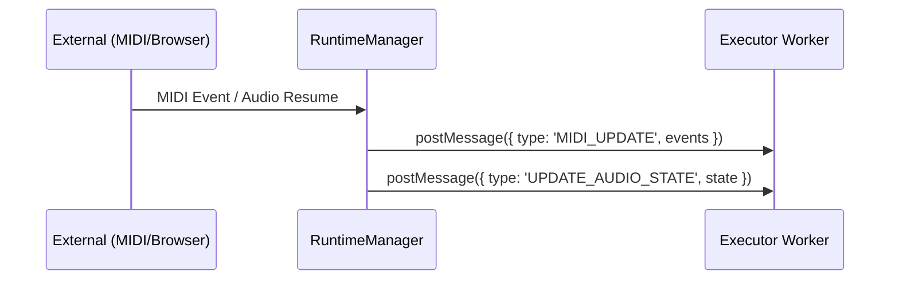
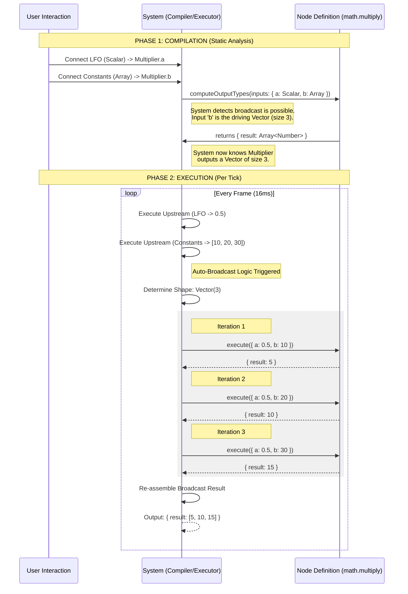

# Execution Flow Architecture

This document outlines the high-level architecture of the application's runtime execution, specifically focusing on the message passing and data flow between the Main Thread (UI), the Compiler Worker, and the Executor Worker.

## Overview

The application uses a **Multi-Worker Architecture** to offload heavy computations (compilation and graph execution) from the Main Thread, ensuring the UI remains responsive even during complex audio/visual synthesis.

### High-Level Components

*   **Main Thread (UI):** Handles user interaction, manages `AppState`, and renders visualizers. It contains the `RuntimeManager` which orchestrates communication with workers.
*   **Compiler Worker:** Compiles the high-level `AppState` (nodes, connections) into an optimized, flat `GraphDefinition`. It also pre-compiles node configurations.
*   **Executor Worker:** Runs the actual graph execution loop. It maintains the `GraphExecutor` instance, processes signals (MIDI, Audio), and computes outputs at a fixed frame rate (typically 60Hz).

## Message Flow Diagrams

### 1. Initial Load & Graph Recompilation

When the user modifies the graph structure (adding nodes, connecting wires), the graph must be recompiled.



### 2. Configuration Updates (Realtime vs Structural)
When the user changes a node parameter (e.g., a slider or dropdown), the system chooses between a lightweight update and a full structural recompile.

**Type A: Parameter Update (Lightweight)**
For simple values (e.g., float slider), we send a config update to the running graph.


**Type B: Structural Update (Heavy)**
If a config change affects ports (e.g., changing 'Pack' node from Float2 to Float4), the node definition returns `true` for `shouldRecompileOnConfigChange`. This triggers a full **Graph Recompilation** (Path #1) to re-run type inference.

### 3. Type Inference & Dynamic Ports

Some nodes (like `Pack`, `Unpack`, `Math`) have dynamic ports that depend on their configuration or connected neighbors.

1.  **Compiler (Inference Pass):**
    *   **Backward Pass:** Propagates type requirements from outputs to inputs (e.g., "Result connected to Vec4 input -> I should be Vec4").
    *   **Forward Pass:** Computes actual types based on config and backward hints (e.g., "Config is 'Vec3' -> I am Vec3").
    *   **Result:** `inferredNodeTypes` map containing exact `RecordType` for inputs/outputs.

2.  **Sync to UI:**
    *   The `GRAPH_COMPILED` message includes `inferredNodeTypes`.
    *   `RuntimeManager` updates `LocalState.inferredNodeTypes`.

3.  **UI Rendering (`GraphNode`):**
    *   The `GraphNode` component reactive render merges:
        *   **Static Ports:** From `repository.ts` definition.
        *   **Inferred Ports:** From `LocalState`.
    *   *Note:* The component creates a fresh merged list each render to avoid mutating the static repository definition.

### 4. Execution Loop (The "Heartbeat")

The Executor Worker runs a high-frequency loop (default 60Hz) to process data and generate signals.



### 4. External Inputs (MIDI & Audio State)

External events like MIDI or browser Audio Context state changes are pushed to the worker immediately.



## Detailed Message Types

### Compiler Worker Messages

| Message Type | Direction | Payload | Description |
| :--- | :--- | :--- | :--- |
| `COMPILE_GRAPH` | Main -> Worker | `state` (AppState), `subgraphs` | Requests a full graph compilation. |
| `GRAPH_COMPILED` | Worker -> Main | `graph` (GraphDefinition) | Returns the executable graph structure. |
| `COMPILE_CONFIGS` | Main -> Worker | `nodes` (List of configs) | Requests compilation of specific node configurations (without full graph rebuild). Runs `compileConfig` for each node. |
| `CONFIGS_COMPILED` | Worker -> Main | `configs` (Map) | Returns compiled config objects ready for the executor. |

### Executor Worker Messages

| Message Type | Direction | Payload | Description |
| :--- | :--- | :--- | :--- |
| `INIT_GRAPH` | Main -> Worker | `graph` | Loads a new execution graph. Supports `isRecompilation` flag to preserve state. |
| `UPDATE_CONFIG` | Main -> Worker | `nodeId`, `config` | Updates the configuration of a live node. |
| `UPDATE_INPUT` | Main -> Worker | `name`, `value` | Updates a specific input value (optimized path for simple values). |
| `CONTROL` | Main -> Worker | `action` (START/STOP/STEP) | Controls the execution loop state. |
| `MIDI_UPDATE` | Main -> Worker | `events`, `values` | Pushes new MIDI data to the worker. |
| `UPDATE_AUDIO_STATE`| Main -> Worker | `state` (running/suspended) | Syncs the browser's AudioContext state. |
| `EXECUTION_UPDATE` | Worker -> Main | `outputs`, `stats`, `audioCommands` |**The Workhorse Message.** Contains node outputs for UI, performance stats, and commands for the `AudioRenderer`. |

## Key Concepts

### 1. `GraphDefinition` vs `AppState`
`AppState` is the source of truth for the UI (positions, names, saved values). `GraphDefinition` is the compiled, flattened instructions for the runtime. Subgraphs are flattened, and virtual inputs are resolved into default values during compilation.

### 2. Auto-Flattening Arrays (Heuristic)
The `GraphExecutor` includes logic to handle strict type matching. If a node expects an **Array** input but receives a **Stream of Scalars**, the executor will automatically collect the stream values into an array before execution. This enables polyphony patterns (e.g., `NicePattern` sequences) without manual "Collect" nodes.

### 3. The "Hero Node" Pattern
To keep the `EXECUTION_UPDATE` message light, nodes that need to visualize high-frequency data (like envelopes or FFTs) use a special side-channel in their output object, often named `ui`. The `RuntimeManager` exposes this via `uiStates`, allowing custom editors to render smooth animations without transferring massive data blobs for every single node in the graph.

## Deep Dive: Node Lifecycle & Broadcast

This section details the lifecycle of a single node execution, specifically illustrating how the **System** (Compiler + Executor) handles type mismatches automatically via **Auto-Broadcast**.

### Example Scenario: Scalar * Vector Multiplication
We have a graph with three nodes:
1.  **LFO** (`math.sin`): Outputs a single scalar number (e.g., `0.5`).
2.  **Constants** (`data.literal`): Configured to output an array `[10, 20, 30]`.
3.  **Multiplier** (`math.multiply`): Input `a` from LFO, Input `b` from Constants.

### Unified Lifecycle Diagram (Compiler + Executor)

This diagram visualizes the flow from the perspective of the **Multiplier Node**. It flattens the Worker boundary to show how configuration and execution interact.



### Auto-Broadcast Mechanics
The `math.multiply` node does **not** need to know about arrays. Its definition is simple:
```typescript
(a, b) => a * b
```
The **Executor** wraps this function. When it sees an Array on input `b` but a Scalar on `a`, and the node defines `autoBroadcast: true`:
1.  It expands `a` to infinite length (repeating `0.5`).
2.  It iterates over the length of the longest array input (`b` -> length 3).
3.  It calls the simple scalar function 3 times.
4.  It collects the results into an array.
